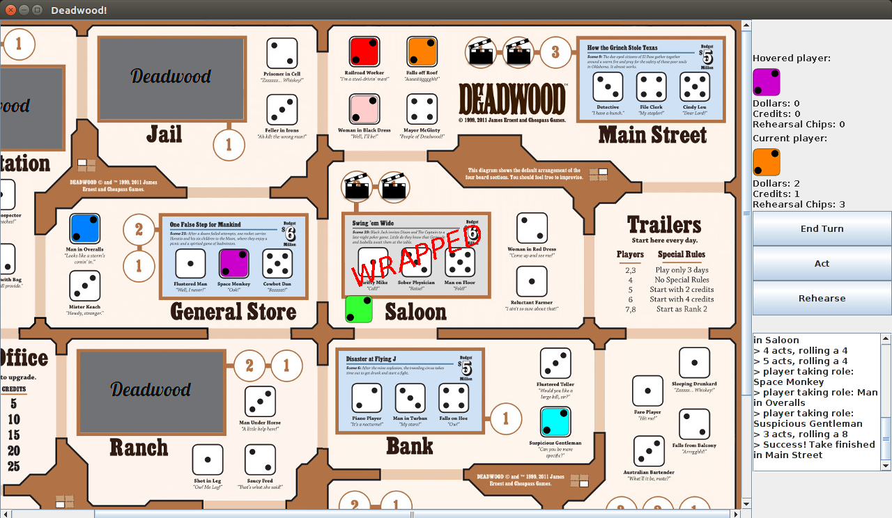

# Deadwood

This project is a Java implementation of the Boardgame [Deadwood](http://cheapass.com/free-games/deadwood/) from Cheapass games. Note that this project is very much in development. The initial phase is wrapping up, but testing and code cleanup-refactoring still needs to take place.

